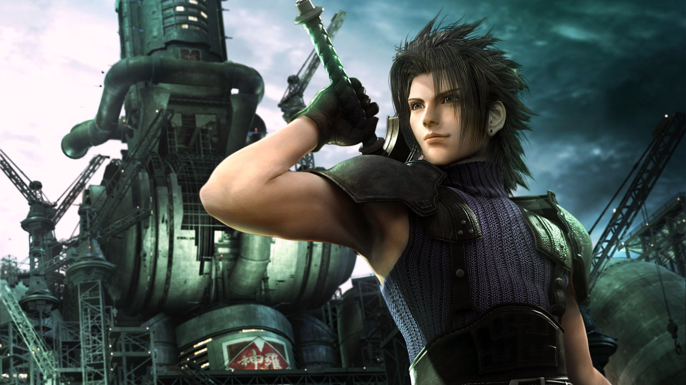

# WAR OF MAGIC           
 

 ### PROJECT

 Create a RGP game as part of the [Becode](https://becode.org/fr/) training in Liège, Belgium.

 Alotted time: 4 days.

 Goals: understanding basic Javascript, Forms input, JSON and DOM manipulation, discover Pair programming.
 ***

 ### Made with 

 
 
 

 Aperçu: 
 ***

### STORY TELLING

In a distant magical land, you fight for your survival in front of armies of fantastic characters.

You hold magical powers to exterminate your opponent in a final fight.

##### YOU FIGHT FOR YOU LIFE UNTIL DEATH....
***
### YOUR CHARACTERS

#####  The Human : always 20% less damage.

##### The Orc: always 40% more of max health.

##### The Elves: always 30% chance to defect the attack back to their oppponents. And the attacker takes 50% dammage equal to 50% of the original hit. And never take dammage.

##### The Vampire: always steal 10% of the life of his opponent each time it's his turn. Nothing to do against that!
***
### YOUR WEAPONS 

##### Boots: 30% chance to dodge an attack.

##### Staff: 20% increase in healing.

##### Sword: 30% more damage.

##### Bow: 30% chance to attack twice.

[more details here ](https://github.com/becodeorg/LIE-Jepsen-3.20/blob/master/02-the-hill/01-javascript/01-rpg-project/README.md)
***
### Ready for Game? So Let's check it out  NOW!!!

(check for play)                                              

                                         
***

 
  
  ### By Team ANSI

* [Simon THIRY](https://github.com/ThiryS).

* [Anne-Sophie SIMANA](https://github.com/anso2410)

